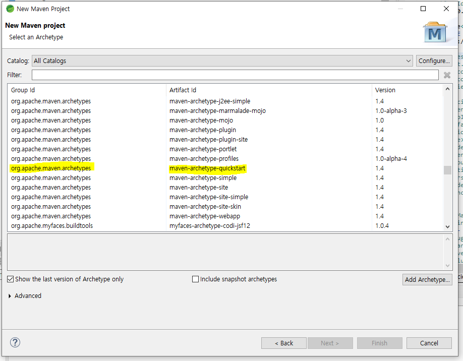
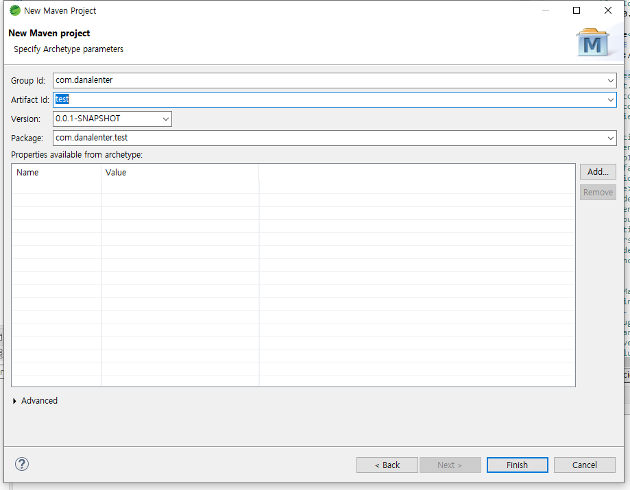

### jar 라이브러리 배포


> jar 개발 시 참고

```
1. 외부라이브러리 또는 maven 으로 추가한 라이브러리 포함하여 배포하지 않는 경우
    jar 내부에서 사용되는 라이브러리를 jar가 주입된 프로젝트(이하 프로젝트)에서 모름.
  ex1) javax.mail.MessagingException 을 jar 에서 사용하였는데
        jar가 주입된 프로젝트에 javax.mail dependency가 없으면 에러남.

        => 해결법은 jar 배포 시 라이브러리를 포함하여 배포하거나 프로젝트에 dependency를 추가

  ex2) jar에서 @Annotation 만들어서 배포했는데
        jar가 주입된 프로젝트에 @Annotation 관련 dependency가 부족하면 서버 기동 시 에러남.

        => jar가 온전히 기동될 수 있도록 jar 내에 dependency를 추가해주면 해결됨.

```


> maven project 생성

</img><br/>

* quickstart 로 선택

</img><br/>

* artifact id 가 프로젝트명으로 사용됨.


* 이클립스 export 로 배포 시 export java source files and resources 는 소스까지 넘어가므로 미체크

<br>

> maven project jar 배포(dependency 라이브러리 포함)

```
$ cd 프로젝트 경로 이동
$ mvn clean assembly:assembly -Dmaven.test.skip=true


pom.xml 아래 내용 추가
<plugin>
	<groupId>org.apache.maven.plugins</groupId>
	<artifactId>maven-assembly-plugin</artifactId>
	<version>2.2.1</version>
	<configuration>
		<descriptorRefs>
			<descriptorRef>jar-with-dependencies</descriptorRef>
		</descriptorRefs>
	</configuration>
</plugin>
```
* project > build > plugins 내에 추가
* dependency 추가된 jar는 파일명 뒤에 jar-with-dependencies 기재되어 있음.
