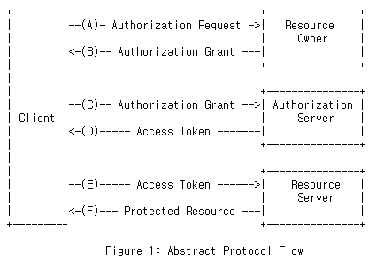
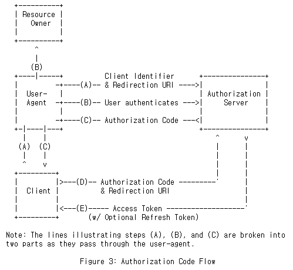
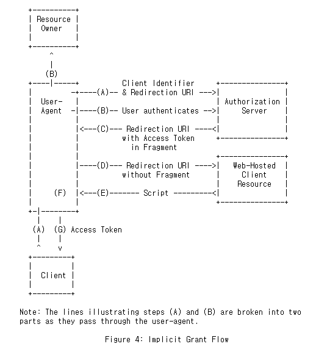
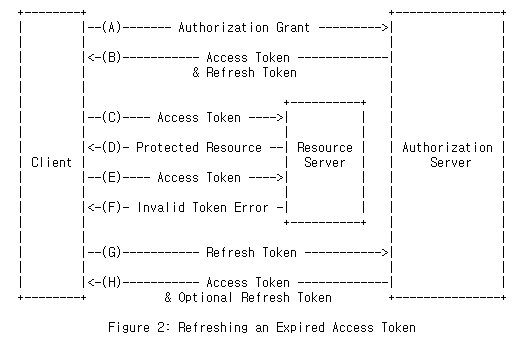

### The OAuth 2.0 Authorization Framework

> OAuth Framework

```
접근 위임을 위한 개방형 표준
제 3의 앱이 자원의 소유자인 서비스 이용자를 대신하여 서비스를 요청할 수 있도록 자원 접근
권한을 위임하는 방법(출처 : 금융보안원 "OAuth 2.0 개요 및 보안 고려사항" 보안연구부-2015-030)

http 이외의 프로토콜을 통해서는 OAuth 를 활용하지 못하며, OAuth 1.0과 2.0은 세부 사항이 상이함.

-- OAuth 1.0 / 2.0 비교표 준비
```


> OAuth 역할

```
- 리소스 소유자
 : 보호된 자원에 대한 액세스 권한을 부여할 수 있는 엔티티(피동)
   액세스 권한을 부여하는 주체가 아닌 부여받는 대상임. 일반 사용자(User)로 이해할 수 있음.


- 리소스 서버
 : 보호된 자원을 호스팅하는 서버로 사용될 수 있는 액세스 토큰 요청에 대해 보호된 자원을 승인하고 응답할 수 있음.

- 클라이언트
 : 리소스 소유자를 대신해 보호된 리소스를 요청하는 응용 프로그램

- 권한 서버
 : 리소스 소유자를 성공적으로 인증하고 권한을 얻은 후 클라이언트에 액세스 토큰을 발급하는 서버


Q 리소스 서버와 권한 서버의 차이
 : 권한 서버는 리소스 서버와 동일한 서버이거나 별도의 엔티티일 수 있음.
 리소스 서버는 액세스 토큰을 검증하고 응답하는데 목적이 있으며, 인증과 관련된 정보는 다루지 않음.
   권한 서버는 액세스 토큰을 발행하는데 목적이 있고, 인증과 무관한 자원 정보는 다루지 않음.
   별도로 구성하는 경우 위와 같이 서버를 관리하고 통합하여 관리할 수도 있음.

```

> OAuth 프로토콜 flow

</img><br/>
```

(A) 클라이언트가 리소스소유자에게 권한부여를 요청함.
권한 부여 요청은 리소스 소유자 (표시된대로)에게 직접 만들어 지거나, 중개자로서 권한 부여 서버를 통해 간접적으로 수행 할 수 있음.

(B) 리소스소유자가 클라이언트에게 권한부여. 권한부여는 네 가지 유형으로 나뉘며, 해당 유형은 권한을 요청하는 방법과 권한 서버가 지원하는 유형에 따라 다름.

(C) 권한부여 서버에게 권한부여를 전달하여 액세스 토큰을 요청함.

(D) 권한 서버는 클라이언트의 권한부여를 확인하여 문제가 없는 경우 액세스 토큰을 발행함.

(E) 클라이언트는 리소스 서버에게 보호된 자원을 요청하고 액세스 토큰을 제출하여 인증하도록 함.

(F) 리소스 서버는 액세스 토큰을 검증하고, 검증이 통과하면 요청을 처리함.

-- 일반적인 흐름으로 실제 요청방식은 권한 획득방식에 따라 차이가 있음. 권한부여를 위해 선호되는 방식은 'Authorization Code Grant' 방식임.

```


> 요청방식, 보안 관련

```
: "application / x-www-form-urlencoded"인코딩 알고리즘을 사용하여 인코딩됨.(token endpoint)
: 권한부여 엔드포인트의 경우 GET 메서드의 사용을 지원해야하며, POST 메소드의 사용도 지원할 수 있음.
: 토큰 엔드포인트의 경우 무조건 POST 메소드만 사용 가능


: TLS(전송계층보안) 사용하여 암호화하여 전송 필요
   1. 지원 가능한 알고리즘 서로 교환
   2. 키 교환, 인증
   3. 대칭키 암호로 암호화하고 메시지 인증

* TLS 적용 대상키
- client_id
- client_secret
- redirect_uri

* TLS 적용 대상 서버
- 권한 부여서버(권한부여 엔드포인트)
- 리디렉션 엔드포인트


-- TLS 적용이 의무는 아니며, TLS 적용을 하지 않는 경우 리소스 소유자에게 경로해야 함(권한 부여 요청 중 메시지 표시)

```


> OAuth 파라미터

```
- response_type
  : code 또는 token 으로 요청
    -- code : Authorization Code 요청방식
    -- token : Implicit 요청방식

- client_id
  : 클라이언트 식별값, 권한서버에 클라이언트 정보 등록 시 부여되는 값

- scope
  : 액세스 요청의 범위 / 액세스 토큰의 범위
  : 공백으로 구분되고 대소문자를 구분하는 문자열 목록으로 표현됨.

- state
  : 교차 사이트 요청 위조를 방지하기 위해 사용
  : 권한서버에 대한 요청과 콜백 사이의 상태를 유지하기 위해 클라이언트에서 정의하는 값


- grant_type
  : authorization_code 로 default 설정


- redirect_uri
  : redirection uri 는 절대 URI 여야함. (4.3. Absolute URI 참고)
  absolute-URI  = scheme ":" hier-part [ "?" query ]
```


> OAuth 권한 획득 방식

* Authorization Code

</img><br/>

```
: Authorization Code 권한 코드는 클라이언트와 자원 소유자 사이의 중개자로서 권한 서버를 사용하여 얻음.
리소스 소유자는 권한 부여 서버로만 인증하기 때문에 리소스 소유자의 자격 증명은 클라이언트와 공유되지 않음.
권한부여를 권한서버에 인증 받은 후 액세스토큰을 받게됨.

(A)/(B) 요청 값 참고
  : 4.1.1. 승인 요청

(C) 응답 값 참고
  : 4.1.2. 승인 응답
  : GET으로 redirect_uri 호출 시 전달

(D) 요청 값 참고
  : 4.1.3. 액세스 토큰

(E) 응답 값 참고
  : 4.1.4. 액세스 토큰 응답
  : json 형식으로 값 구성하여 응답
```

* Implicit

</img><br/>

```
: JavaScript와 같은 스크립팅 언어를 사용하여 브라우저에서 구현 된 클라이언트에 최적화 된 단순화 된 인증 코드 흐름
클라이언트에게 권한 부여 코드를 발급하는 대신 클라이언트에 직접 액세스 토큰이 발급됨.(권한부여를 인증하여 액세스토큰 교환을 하는 것이 아닌 요청 후 redirect uri에 액세스토큰 포함되어 전달됨.-Authorization code와 가장 큰 차이이며 redirect uri에 액세스 토큰이 있는 관계로 다른 응용프로그램에 노출될 수 있음.)
암시적 권한부여 유형은 클라이언트 인증을 포함하지 않으며, 리소스 소유자의 존재와 리디렉션 uri의 등록에 의존함.

(A)/(B) 요청 값 참고
  : 4.2.1 승인 요청

(C) 응답 값 참고
  : 4.2.2 액세스 토큰 응답

```


* Resource Owner Password Credentials

```
: 리소스 소유자 암호 자격 증명
 리소스 소유자 암호 자격 증명 (즉, 사용자 이름 및 암호)은 액세스 토큰을 얻기위한 권한 부여로 직접 사용할 수 있음.
  자격 증명은 리소스 소유자와 클라이언트간에 높은 수준의 신뢰가있을 때  및 다른 권한 부여 유형을 사용할 수없는 경우에만 사용해야 함.
```

* Client Credentials

```
 : 라이언트 자격 증명은 일반적으로 클라이언트가 자신을 대신하여 작동하거나 (클라이언트가 리소스 소유자이기도 함) 이전에 권한 부여 서버에 배열 된 권한을 기반으로 보호 된 리소스에 대한 액세스를 요청할 때 권한 부여로 사용됨.
```

<br>

> 액세스 토큰 & refresh 토큰

</img><br/>

```
- 액세스 토큰
 : 보호된 리소스에 액세스하는데 사용되는 자격증명으로 인증 정보를 검색하는 데 사용되는
 식별자를 나타내거나 검증 가능한 방식으로 인증 정보를 자체 포함할 수 있음.
 여러 인증구성(사용자 이름 및 암호)을 리소스 서버가 이해하는 단일 토큰으로 대체함.
 액세스할 수 있는 리소스 유형, 만료기간 등이 설정되어 리소스 접근에 유효성을 검증함.

- refresh 토큰
 : refresh 토큰은 액세스 토큰을 얻는데 사용되는 자격증명임.
   refresh 토큰은 권한 부여 서버에 의해 클라이언트에 발급되며 현재 액세스 토큰이 유효하지 않거나
   만료될 때 새 액세스 토큰을 얻거나 범위가 동일하거나 더 좁은 추가 액세스 토큰을 얻는데 사용됨.
   refresh 토큰은 권한 서버의 재량으로 액세스 토큰 발행 시 포함하여 발행할 수 있음.
   액세스 토큰과 달리 새로 고침 토큰은 권한 부여 서버에서만 사용하기위한 것이며 리소스 서버로 전송되지 않음.


https://datatracker.ietf.org/doc/html/rfc6750

Q 위 내용 참고하여 토큰 생성 방식 확인

```

> 클라이언트 등록/인증/Redirect URL

```
 : OAuth 2.0 프로토콜 시작을 위해 인증 서버(권한 서버)에 클라이언트 정보 등록이 필요함.
 : 이후 클라이언트 요청 시 Redirect URL에 대한 검증이나 인증 서버(권한 서버)와 클라이언트 상호 간 주고받은 KEY(client_id)를 통해 인증 절차를 추가로 가질 수 있음.
 : 권한부여서버에 클라이언트 등록 시 리디렉션 URI를 요구.
 : 권한부여서버는 여러 리디렉션 엔드포인트를 등록하도록 허용할 수 있고, 리디렉션 URI를 개방형 리디렉터로 사용할 수 있음(리디렉터엔드포인트를 매개변수로 동적으로 변경하여 처리할 수 있음).
 -- 개방형 리디렉터는 보안에 취약하므로 주의가 필요함.

```


> OAuth endpoint

```
- Authorization endpoint(권한 부여 끝점)
 : 클라이언트가 사용자 에이전트 리디렉션을 통해 리소스 소유자로부터 권한 부여
 : Authorization Code, Implicit 권한 획득 방식에서 사용됨.


- Token endpoint(토큰 끝점)
 : 클라이언트가 권한 교환 시 사용, 일반적으로 클라이언트 인증을 사용해 액세스 토큰을 부여함.
 : Implicit 권한 획득 방식을 제외한 모든 권한 부여 유형에서 사용됨.
 : 액세스 토큰 요청 시에는 무조건 POST 메소드만 사용 가능


- Redirection endpoint(리디렉션 끝점)
 : 권한 부여 서버가 리소스 소유자 사용자 에이전트를 통해 권한 부여 자격 증명이 포함 된 응답을 클라이언트에 반환하는 데 사용됩니다.
 : 클라이언트 등록 프로세스 또는 권한 요청을 만들 때 전달된 redirection endpoint 로
 사용자 에이전트를 클라이언트에게 보냄.


** 리디렉션 엔드 포인트는 요청 된 응답 유형이 "코드"또는 "토큰"이거나
리디렉션 요청이 개방형 네트워크를 통해 민감한 자격 증명을 전송하게 될 때
섹션 1.6에 설명 된대로 TLS를 사용해야합니다 (SHOULD).
** 리디렉션 URI가 다중 등록 또는 매개변수 전달이 가능하나 일반적인
OAuth API 서비스에서는 어떤식으로 활용되고 있는 지 확인할 필요가 있어보임.

```


> OAuth 보안 이슈


> OAuth 파라미터 인코딩

```
https://datatracker.ietf.org/doc/html/rfc6749#appendix-B
참고
```


* 출처 :
<br>https://datatracker.ietf.org/doc/html/rfc6749
<br>https://oauth.net/2/
<br>https://cheese10yun.github.io/oauth2/


> 응답값에 공백으로 구분된 (%x20) 이 뭔지 찾아보기
