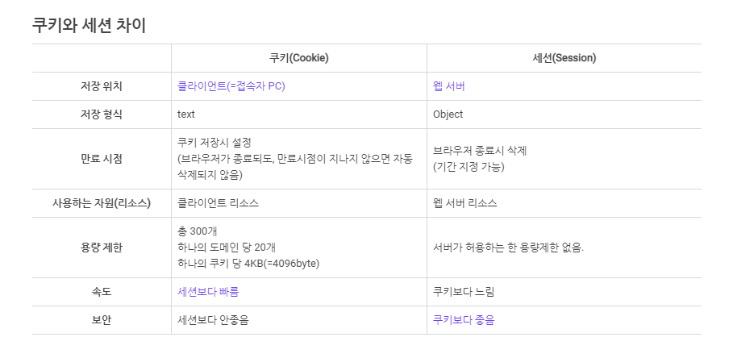
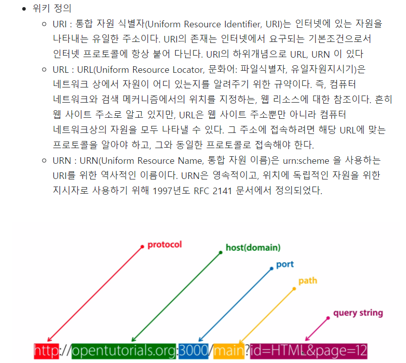

> http 개념

```
HTML 문서를 주고 받는데 쓰이는 통신프로토콜(통신규약)이며,
TCP와 UDP를 사용하여 통신하며 80번 포트를 사용하는 통신프로토콜(통신규약)임.

-- 통신프로토콜 : 통신규약이라고도 하며 컴퓨터나 원거리 통신 장비 사이에서 메세지를 주고 받는 양식과 규칙의 체계임. 이는 신호체계, 인증, 오류감지 기능을 포함할 수 있음.
```

> http 특징

```
1. http 메시지는 서버와 클라이언트에 의해 해석됨.
2. TCP/IP를 이용하는 응용프로토콜임.
3. http는 연결상태를 유지하지 않는 비연결성 프로토콜임. 클라이언트가 이전에 요청한
   내용을 기억하고 있지 않음.
4. 비연결성의 단점을 해결하기 위해 cookie와 session이 등장함.
5. 비연결성 프로토콜이기 때문에 요청/응답 방식으로 동작함.
6. 도메인 + 자원위치(URL), 도메인 + 자원의 식별자(URI) 를 통해서 요청을 하고,
   서버가 요청에 따른 HTML 문서응답을 해줌.
7. HTML 문서만이 HTTP 통신을 위한 유일한 정보문서는 아님.
    - plain text로부터 json데이터 및 xml과 같은 형태의 정보도 주고 받을 수 있음.
    - 보통은 클라이언트가 어떤 정보를 html 형태로 받고 싶은지, json형태로 받고 싶은 지 명시하는 경우가 많음.
8. http가 전체 인터넷 프로토콜에서 위치하는 곳은 응용계층임.
    - 응용 계층(DNS, FTP, HTTP)
    - 전송 계층(TCP, UDP, SCTP)
    - 네트워크 계층(IP, ARP, RARP)
    - 링크 계층(이더넷, WIFI, 토큰링)
```

> http request / response

```
- request 메시지
  : Request-Line
    URL 정보, 요청방식(method), http버전정보 제공의 규칙.

  : (( general-header | request-header | entity-header) CRLF )
    헤더에는 요청하는 클라이언트PC, 브라우저정보, 사용자언어환경, 쿠키 등의 다양한
    클라이언트 환경에 대한 정보를 가지고 있음. 헤더영역에 존재하는 데이터는 보안에 취약함.

  : CRLF
    줄바꿈 명령어

  : message-body
    http 본문영역, 주로 클라이언트가 입력한 데이터를 저장하는 영역임.
    입력폼에 입력한 각종 데이터가 method 방식에 따라 서버로 전달할 때 보안이 강화된 방식으로 message-body에 넣어 전달함.

- response 메시지
  : Status-Line
    응답 상태정보 표시 라인. http 버전정보와 세자리 숫자값과 상태코드값을 통해 응답결과 및 상태정보를 나타냄.

  : 응답 헤더정보 제공
    각종 서버 및 웹사이트 관련 환경정보를 제공

  : message-body
    http 본문영역, 주로 서버에서 사용자에게 전달되는 HTML 소스 및 포함된 데이터를 저장하는 영역

- header 종류
  : General Header
    요청과 응답에 모두 적용되지만, 데이터와는 관련이 없는 헤더
    date 나 connection(클라이언트와 서버 간의 연결에 대한 옵션) 등

  : Request Header
    요청하는 클라이언트에 대한 자세한 정보를 포함하는 헤더
    Host, User-Agent, Cookie 등

  : Response Header
    서버 자체에 대한 정보, 응답에 대한 부가적인 정보를 포함하는 헤더
    server, allow, ETag, Access-Control-Allow-Origin 등

  : Entity Header
    컨텐츠의 길이나 MIME 타입과 같이 엔티티 바디에 대한 자세한 정보를 포함하는 헤더
    Content-Type, Content-Length 처럼 엔티티(콘텐츠, 본문, 리소스) 관련 정보 등

- http Content-Type
  : Application/x-www-form-urlencoded : HTML Form 형태
  : Application/json : JSON 형태값
  : multipart/form-data : 파일 첨부
  : text/* : 단순 html, css, javascript 파일
  ** Application/x-www-form-urlencoded 과 form-data 모두 폼데이터이지만,
     x-www-form-urlencoded 는 대용량 바이너리를 보내는데 비능률적이다.
```

> cookie / session

```
- 사용이유
  http 프로토콜의 아래 특징들을 보완하고자 사용하게 됨.

  : Connectionless 프로토콜(비연결지향)
    클라이언트가 서버에 요청을 했을 때, 그 요청에 맞는 응답을 보낸 후 연결을 끊는 처리방식임.
    - http 1.1 버전에서 연결을 유지하고, 재활용 하는 기능이 default로 추가됨.
    (keep-alive 값으로 변경 가능)

  : Stateless 프로토콜(상태정보 유지 안함)
    클라이언트의 상태 정보를 가지지 않는 서버 처리 방식임.
    클아이언트와 첫 번째 통신에서 데이터를 주고 받았다 해도, 두 번째 통신에서 이전 데이터를 유지하지 않음.

  클라이언트와 서버 간의 정보 유지(로그인 정보 등)를 하기 위해 사용하는 것이 쿠키와 세션임. 쿠키와 세션의 가장 큰 차이는 저장 위치라고 할 수 있음.

- cookie
  사용자의 컴퓨터에 저장하는 작은 기록 정보 파일

  : 특징
    1. 이름, 값, 만료일(저장 기간 설정), 경로 정보로 구성되어 있음.
    2. 클라이언트에 총 300개의 쿠키를 저장할 수 있음.
    3. 하나의 도메인 당 20개의 쿠키를 가질 수 있음.
    4. 하나의 쿠키는 4KB까지 저장 가능함.

  : 동작순서
    1. 클라이언트가 페이지를 요청함.
    2. 웹 서버는 쿠키를 생성함.
    3. 생성한 쿠키에 정보를 담아 HTTP 화면을 돌려줄 때, 같이 클라이언트에 돌려줌.
    4. 넘겨 받은 쿠키는 클라이언트가 가지고 있다가 다시 서버에 요청할 때 요청과 함께 쿠키를 전송함.
    5. 동일 사이트 재방문 시 클라이언트의 PC에 해당 쿠키가 있는 경우 요청 페이지와 함께 쿠키를 전송함.

- session
  웹 서버에 접속한 시점부터 웹 브라우저를 종료하여 연결을 끝내는 시점까지 일련의 요구를 하나의 상태로 보고, 그 상태를 일정하게 유지시키는 기술임.
  방문자가 웹 서버에 접속해 있는 상태를 하나의 단위로 보고 그것을 세션이라고 함.

  : 특징
    1. 웹 서버에 웹 컨테이너의 상태를 유지하기 위한 정보를 저장함.
    2. 웹 서버의 저장되는 쿠키(=세션 쿠키)
    3. 브라우저를 닫거나 서버에서 세션을 삭제했을 때만 삭제가 되므로, 쿠키보다 비교적 보안이 좋음.
    4. 저장 데이터에 제한이 없음.(서버 용량 한도 내에서)
    5. 각 클라이언트 고유 session id를 부여함.
    session id로 클라이언트를 구분하여 각 클라이언트 요구에 맞는 서비스 제공

  : 동작순서
    1. 클라이언트가 페이지를 요청함.
    2. 서버는 접근한 클라이언트의 Request-Header 필드인 Cookie를 확인하여,
       클라이언트가 해당 session-id를 보냈는지 확인한다.
    3. session-id가 존재하지 않는다면, 서버는 session-id를 생성해 클라이언트에게 돌려준다.
    4. 서버에서 클라이언트로 돌려준 session-id를 쿠키를 사용해 서버에 저장한다.
    쿠키 이름 : JSESSIONID
    5. 클라이언트는 재접속 시,
    이 쿠키(JSESSIONID)를 이용하여 session-id 값을 서버에 전달

```

</img><br/>


> URL / URI

</img><br/>

> get / post

```
- GET
  정보를 가져와서 조회하기 위해서 사용되는 방식

  * 특징
    - URL에 변수(데이터)를 포함시켜 요청함.
    - 데이터를 Header에 포함하여 전송함.
    - URL에 데이터가 노출되어 보안에 취약함.
    - 캐싱할 수 있음.

  HTTP 자체에서는 GET방식의 URL 길이에 제약을 두고 있지 않지만, 브라우저에서 최대 길이를 제한하고 있어 데이터를 보내는데 한계가 있음.
  body는 보통 빈상태로 전송되며, body의 데이터를 설명하는 Content-Type 헤더 필드도 들어가지 않음.

- POST
  데이터를 서버로 제출하여 추가 또는 수정하기 위해서 사용하는 방식

  * 특징
    - URL에 변수(데이터)를 노출하지 않고 요청함.
    - 데이터를 body에 포함시킴.
    - URL에 데이터가 노출되지 않아서 기본 보안은 되어 있음.
    - 캐싱할 수 없음.

  GET 방식은 URL에 데이터를 붙여서 전송하고, POST 방식은 body에 데이터를 넣어서 전송함.
  header의 body 데이터를 설명하는 Content-Type 필드가 들어가고 어떤 데이터 타입인지도 명시되어 있음.

```

* 출처 : https://velog.io/@doomchit_3/Internet-HTTP-%EA%B0%9C%EB%85%90%EC%B0%A8%EB%A0%B7-IMBETPY
https://hahahoho5915.tistory.com/32
https://mangkyu.tistory.com/17
https://velog.io/@jch9537/URI-URL
